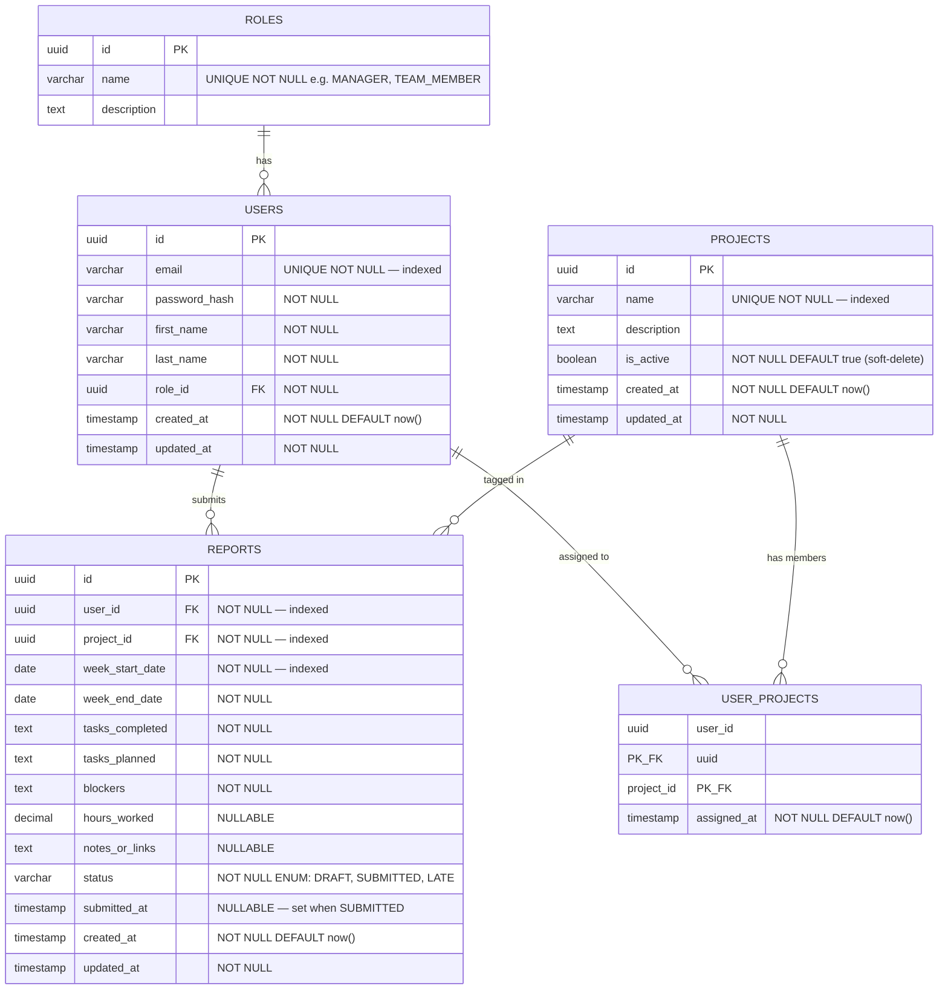

# Database Design & Schema Architecture

This document is the authoritative reference for the database schema. All Prisma models must be generated from this specification. The design enforces **ACID compliance**, **3NF normalization**, and integrity at the database level.

> **Database Provider:** [Neon](https://neon.tech) — Serverless PostgreSQL. No local database installation is required. All contributors connect to the same cloud-hosted Neon project using its connection string.

---

## 1. ACID & Normalization Principles

| Principle | How It Is Enforced |
|---|---|
| **Atomicity** | Prisma `$transaction()` used for multi-step operations (e.g., user registration + default project assignment). |
| **Consistency** | FK constraints, UNIQUE constraints, CHECK constraints, and NOT NULL at DB level. |
| **Isolation** | PostgreSQL Read Committed default. Heavy manager aggregate queries should not block member writes. |
| **Durability** | PostgreSQL WAL (Write-Ahead Logging) — guaranteed natively. |
| **1NF** | All columns are atomic. No arrays of scalar values. `tasks_completed`, `blockers` are single text fields. |
| **2NF** | All non-key attributes depend on the full PK. Composite PKs in `user_projects` enforce this. |
| **3NF** | No transitive dependencies. `role_name` lives in `roles`, not on `users`. `project_name` lives in `projects`, not on `reports`. |

---

## 2. Entity-Relationship (ER) Diagram



---

## 3. Table Definitions & Constraints

### `roles`
Stores fixed RBAC role definitions. Seeded at startup — not created by users.

| Column | Type | Constraints |
|---|---|---|
| `id` | UUID | PK, DEFAULT gen_random_uuid() |
| `name` | VARCHAR(50) | UNIQUE, NOT NULL |
| `description` | TEXT | NULLABLE |

**Seed data:** `MANAGER`, `TEAM_MEMBER`

---

### `users`
Core authentication and identity table.

| Column | Type | Constraints |
|---|---|---|
| `id` | UUID | PK, DEFAULT gen_random_uuid() |
| `email` | VARCHAR(255) | UNIQUE, NOT NULL, **INDEX** |
| `password_hash` | VARCHAR(255) | NOT NULL |
| `first_name` | VARCHAR(100) | NOT NULL |
| `last_name` | VARCHAR(100) | NOT NULL |
| `role_id` | UUID | FK → `roles.id`, NOT NULL |
| `created_at` | TIMESTAMP | NOT NULL, DEFAULT now() |
| `updated_at` | TIMESTAMP | NOT NULL |

> **Security:** `password_hash` is never returned in API responses. Use Prisma `select` or a response interceptor to exclude it explicitly.

---

### `projects`
Work categories/tags that team members attach to reports.

| Column | Type | Constraints |
|---|---|---|
| `id` | UUID | PK |
| `name` | VARCHAR(100) | UNIQUE, NOT NULL, **INDEX** |
| `description` | TEXT | NULLABLE |
| `is_active` | BOOLEAN | NOT NULL, DEFAULT `true` |
| `created_at` | TIMESTAMP | NOT NULL, DEFAULT now() |
| `updated_at` | TIMESTAMP | NOT NULL |

> **Soft Delete:** Managers set `is_active = false` instead of hard-deleting, preserving historical report integrity.

---

### `user_projects`
Optional many-to-many mapping: restricts which projects a member can report on.

| Column | Type | Constraints |
|---|---|---|
| `user_id` | UUID | PK (composite), FK → `users.id` ON DELETE CASCADE |
| `project_id` | UUID | PK (composite), FK → `projects.id` ON DELETE CASCADE |
| `assigned_at` | TIMESTAMP | NOT NULL, DEFAULT now() |

---

### `reports`
The core business entity. Fixed schema — no dynamic fields.

| Column | Type | Constraints |
|---|---|---|
| `id` | UUID | PK |
| `user_id` | UUID | FK → `users.id` ON DELETE CASCADE, NOT NULL, **INDEX** |
| `project_id` | UUID | FK → `projects.id` ON DELETE RESTRICT, NOT NULL, **INDEX** |
| `week_start_date` | DATE | NOT NULL, **INDEX** |
| `week_end_date` | DATE | NOT NULL |
| `tasks_completed` | TEXT | NOT NULL |
| `tasks_planned` | TEXT | NOT NULL |
| `blockers` | TEXT | NOT NULL |
| `hours_worked` | DECIMAL(5,2) | NULLABLE |
| `notes_or_links` | TEXT | NULLABLE |
| `status` | VARCHAR(20) | NOT NULL, DEFAULT `'DRAFT'`, CHECK IN ('DRAFT','SUBMITTED','LATE') |
| `submitted_at` | TIMESTAMP | NULLABLE — populated on SUBMITTED transition |
| `created_at` | TIMESTAMP | NOT NULL, DEFAULT now() |
| `updated_at` | TIMESTAMP | NOT NULL |

**Critical Constraints:**
*   `UNIQUE(user_id, project_id, week_start_date)` — Prevents duplicate reports for the same project in the same week.
*   `CHECK (week_end_date > week_start_date)` — Data integrity.
*   `CHECK (hours_worked >= 0 AND hours_worked <= 168)` — Max hours in a week.

---

## 4. Database Indexes Summary

| Table | Column(s) | Type | Reason |
|---|---|---|---|
| `users` | `email` | UNIQUE INDEX | Fast auth lookup |
| `projects` | `name` | UNIQUE INDEX | Fast filter lookup |
| `reports` | `user_id` | INDEX | Dashboard: filter by member |
| `reports` | `project_id` | INDEX | Dashboard: filter by project |
| `reports` | `week_start_date` | INDEX | Dashboard: filter by week |
| `reports` | `(user_id, project_id, week_start_date)` | UNIQUE INDEX | Prevent duplicate reports |

---

## 5. Prisma Implementation Notes

```prisma
// Key Prisma directives to use:

model User {
  id           String   @id @default(uuid())
  email        String   @unique
  passwordHash String   @map("password_hash")
  // ... all columns
  @@map("users")
}

model Report {
  // ...
  @@unique([userId, projectId, weekStartDate])
  @@index([userId])
  @@index([projectId])
  @@index([weekStartDate])
  @@map("reports")
}
```

*   Use `@map()` on fields and `@@map()` on models to enforce `snake_case` in PostgreSQL while keeping `camelCase` in TypeScript.
*   Use `@@unique([...])` for composite unique constraints.
*   Use Prisma `$transaction([...])` for any multi-table write operations.
*   Run `npx prisma migrate dev` for each schema change. Never modify the database directly.
*   Seed the database with `npx prisma db seed` to populate `MANAGER` and `TEAM_MEMBER` roles on first run.

### Neon-Specific Configuration
*   In `schema.prisma`, use the standard PostgreSQL provider:
    ```prisma
    datasource db {
      provider = "postgresql"
      url      = env("DATABASE_URL")
    }
    ```
*   The Neon connection string **must** include `?sslmode=require`. Prisma handles SSL automatically when this is present.
*   Neon provides **branching** — use a separate Neon branch for development and another for production to avoid polluting production data during migrations.
